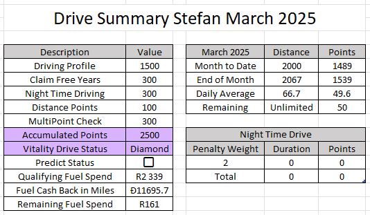
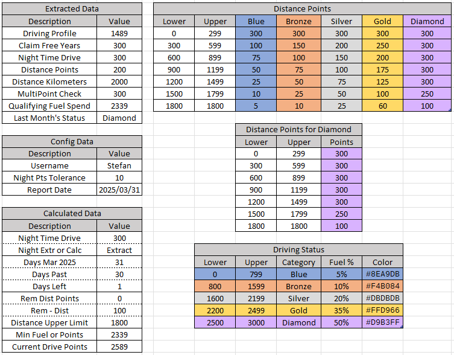

<!-- # Excel Drive Summary -->

## Discovery Vitality Drive Dashboard Excel Summary
**by Stefan Oberholzer, 2024.**

Scrape data from Vitality Drive Dashboard and predict the month's drive status in Excel.

 \
*Figure: Vitality Drive Dashboard.*

 \
*Figure: Drive Summary in Excel.*

### Approach
**UiPath** was used to scrape the data from the Discovery Vitality Drive Dashboard. The automation can run for multiple users and extract the distance travelled for each user through the DQMapper. 

**Excel** contains some hidden calculated fields to make the prediction. The night time driving should be updated manually, since the dashboard values are rarely correct. Similarly, the distance points are calculated which is more accurate than the extracted data.

 \
*Figure: The extracted, configuration and calculated data, with the corresponding lookup tables.*